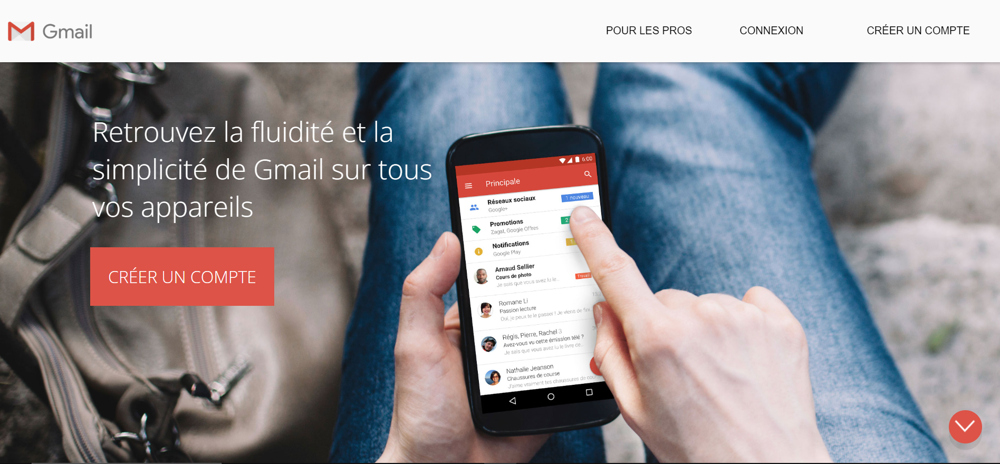
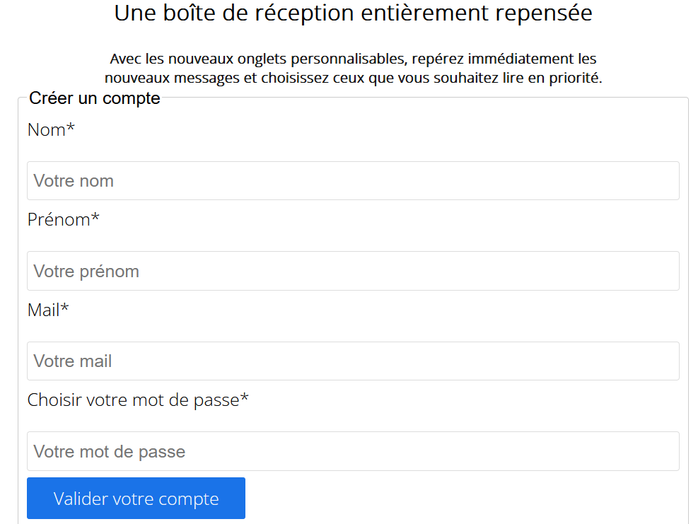
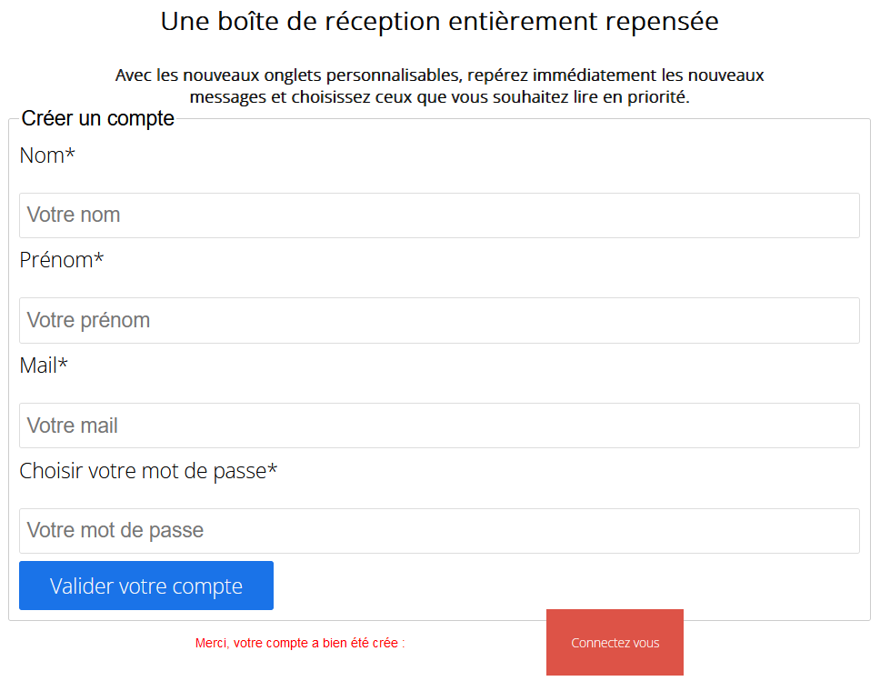
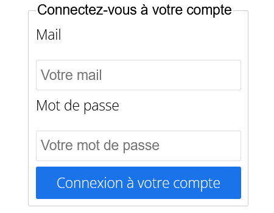
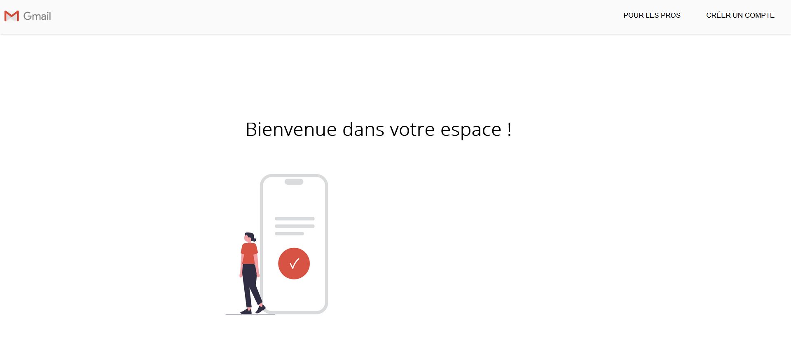

# Page Gmail
Bienvenue sur cette fausse page Gmail. Réalisée en HTML, CSS et PHP.

LIEN VERS [LA PAGE](https://theocou.github.io/Page_copy_gmail/!index.html) (STATIC)

## Charte Graphique et Typographique
- Police de caractère : Open-Sans, sans-serif, taille de base dans le corps (body) : 1.6rem.
- Couleur des boutons et items : #dd5347.
- Couleur de fond : #fafafa.
- Poids de la police (font-weight) : 300 (bolder).

## Fonctionnement 🔧
Vous voici sur un projet imitant une page Gmail, la messagerie de Google 📫. 
Sur ce projet il est possible de créer un compte relié à une base de données MySQL. Et de vous connecter ensuite avec les logins/password renseignés lors de la création de votre compte.   

On commence par la création du compte dans le formulaire 📋.

    

Le compte est maintenant créé ! Cliquez sur le bouton pour l'étape suivante.

    

Rentrez le login et le mot de passe rentré précédement.

    

Si les informations rentrées sont bonnes, vous voilà connecté(e) 🎉✨ !
